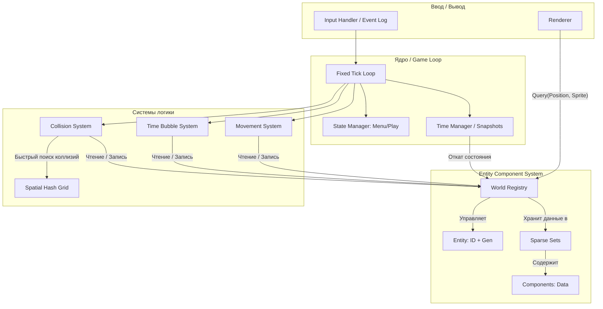
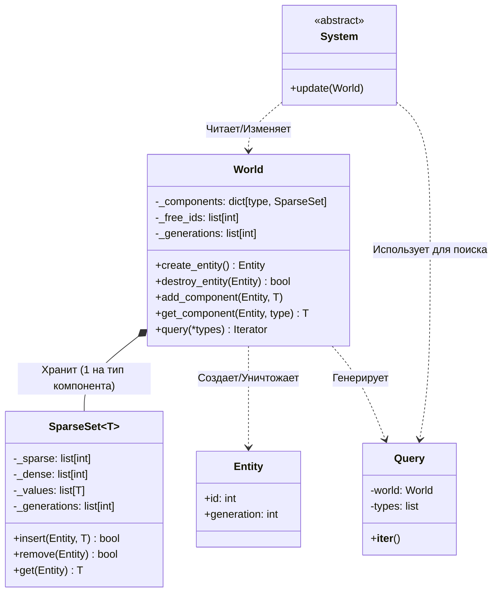
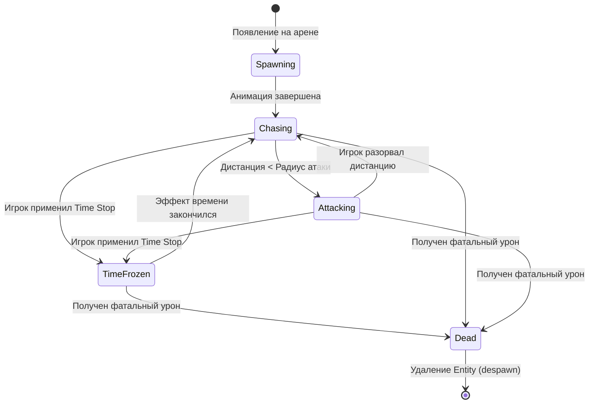
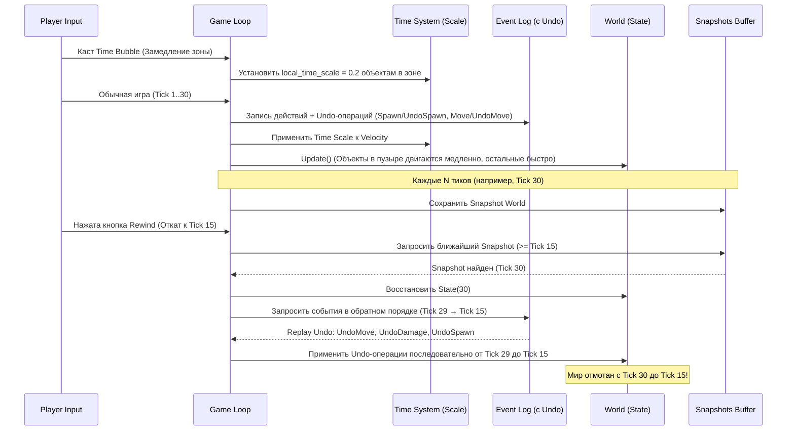

# Презентация проекта: Luna Dial Survivors

## Основная идея

**Жанр:** Bullet Heaven / Roguelike + Time Manipulation Sandbox.

**Игрок:** Сакуя (персонаж вселенной Touhou) — горничная, которая мастерски метает ножи и обладает способностью гибко управлять временем (останавливать, замедлять, ускорять и отматывать).

**Цель:** Выживать против огромных волн врагов и сложных боссов, комбинируя различные типы ножей и манипуляции со временем (остановка, замедление, ускорение, откат) для прохождения уровней и забегов (рогалик-прогрессия).

**Описание:** 
Это динамичный 2D-экшен, в котором механики выживания против толп врагов объединяются с глубокой песочницей управления временем. Игрок не только сражается тысячами ножей с уникальными свойствами (рикошеты, задержка во времени, пробивание), но и буквально перекраивает поле боя с помощью локальных временных пузырей и откатов (rewind), создавая уникальные боевые комбинации.

## Основные игровые фичи и механики

- **Передвижение и атака:** игрок перемещается (WASD) и стреляет ножами в сторону курсора; при контакте с врагом или его пулей теряет здоровье. **Результат:** необходимость постоянного маневрирования в огромной толпе врагов (bullet hell).
- **Система ножей (Knives):** игрок комбинирует типы снарядов (обычные, рикошетящие, отложенные, кружащиеся). **Правило:** разные ножи имеют уникальное поведение и по-разному реагируют на манипуляции со временем. **Результат:** создание сложных многоходовых ловушек.
- **Двойной ресурс (Мана + Мана времени):** у игрока два независимых ресурса. **Мана** расходуется на spell cards — особые паттерны ножей, баффы характеристик, не-временная магия. **Мана времени** расходуется на способности управления временем (Time Stop, Slow, Rewind, Time Bubbles). **Правило:** разные способности времени расходуют ману времени с разной скоростью (Time Stop — быстро, Time Bubble — медленно). **Результат:** игрок должен выбирать между магическими комбо и манипуляциями со временем, а не просто тратить один ресурс на всё.
- **Локальное время (Time Bubbles):** игрок применяет spell-карты (расход маны времени). **Правило:** на поле боя создаются зоны с измененным течением времени (остановка, замедление, ускорение), в которых враги и снаряды меняют свою скорость. Способности применяются по курсору или вокруг игрока (в зависимости от способности). **Результат:** тактический контроль над зонированием и спасение из безвыходных ситуаций.
- **Откат времени (Rewind):** игрок активирует перемотку времени назад. **Правило:** состояние мира (враги, пули) откатывается в прошлое через replay событий в обратном порядке (Undo), но некоторые особые объекты (например, time-anchored ножи) не подчиняются откату. **Результат:** возможность отменить неудачные действия и переиграть ситуацию, сохраняя стратегически размещённые объекты.
- **Прогрессия (Roguelike):** враги нападают волнами (аренами). **Правило:** побежденные враги роняют опыт, ману и ману времени. Опыт накапливается — при повышении уровня игрок получает небольшое повышение базовых статов + случайный выбор из 3 вариантов улучшения: улучшить тип ножей, добавить новый тип ножей, добавить/заменить/улучшить spell card, получить/изменить способность управления временем. **Результат:** между волнами игрок собирает уникальный билд, гибко комбинируя ножи, spell cards и силы времени.

## Измеримые критерии успешности проекта (MVP на 20 дней)

### Функциональные требования:
- Игрок может пережить минимум 1 полноценную арену (волну), состоящую из 3 фаз нарастающей сложности.
- Успешно функционируют минимум 3 типа ножей (например: обычный, отложенный/delayed, рикошетящий) и корректно взаимодействуют с временными зонами.
- Игрок может использовать откат времени (Rewind) без поломки логики игры и крашей.

### Технические требования:
- **Производительность:** стабильные >= 60 FPS при наличии 1000+ активных объектов на экране (ножи, враги, партиклы) благодаря использованию кастомного Sparse Set ECS в Python.
- **Оптимизация:** коллизии и попадания рассчитываются за <= 5 мс на кадр за счет применения Spatial Hash Grid.
- **Детерминизм:** независимая от FPS симуляция (fixed tick 120Hz) позволяет сделать откат времени (rewind) на 3-5 секунд назад 100% точным с помощью кольцевого буфера снапшотов.
- **Сохранение:** прогресс текущего забега и настройки конфигурации корректно сохраняются и загружаются из JSON-файла.

### Критерии готовности:
- Присутствует главное меню с пунктами «Начать игру», «Настройки», «Выход».
- Реализован полный цикл: меню -> арена -> прокачка (выбор 1 из 3 улучшений) -> следующая арена -> смерть/победа -> меню.
- Визуально понятно, когда работают временные эффекты (например, смена оттенка экрана, замедление анимаций спрайтов).

### Ограничения (что осознанно НЕ включено в проект):
- **Сложная генерация лабиринтов:** уровни представляют собой статичные или замкнутые арены-комнаты без процедурно-генерируемых коридоров.
- **Мультиплеер и сеть:** игра строго одиночная.
- **Глубокий сюжет и катсцены:** фокус исключительно на механике геймплея и движке.
- **Множественные ветвления таймлайнов (Timeline Fracture):** в рамках MVP реализуется только классический откат (Rewind) и исключения для некоторых ножей (time-anchored). Полноценный кооператив со своими прошлыми версиями отложен до будущих версий.

## Архитектура проекта

В игре используется **ООП-архитектура с паттерном Entity-Component-System (ECS)** на основе Sparse Sets для обработки больших массивов объектов, в связке с детерминированным игровым циклом (Fixed Tick Simulation).

### Почему ECS для обработки объектов?
В игре одновременно существуют тысячи объектов (ножи, враги), и присутствует механика перемотки времени (Rewind). 
- Обрабатывать каждый объект индивидуально через `update()` при 1000+ сущностях на Python — убило бы кэш процессора.
- Сохранять состояние графа объектов каждый кадр для откатов времени — слишком затратно по памяти и ресурсам.
- **ECS решает эту проблему:** данные (компоненты) хранятся в плоских массивах (cache locality), а логика (системы) работает пакетами. Сохранение состояния мира (Snapshot) для перемотки времени сводится к простому копированию нескольких массивов данных.

### Ключевые компоненты и их ответственность

- **Game (Game Loop):** Главный цикл фиксированного шага (Fixed Tick, 120Hz). Аккумулирует реальное время и вызывает обновления систем. Гарантирует детерминизм симуляции (важно для отката времени).
- **State Manager (Scene):** Управляет глобальными состояниями (Menu, Gameplay, Pause, Upgrades).
- **World (Registry):** Центральное хранилище. Создаёт/удаляет `Entity`, хранит `Components` внутри структур *Sparse Set*, предоставляет `Query` (поиск сущностей по набору компонентов).
- **Entity:** Не объекты, а просто уникальные числовые ID с поколением (generation) для защиты от "мертвых" ссылок при пересоздании ножей.
- **System:** Изолированная логика, которая запрашивает данные из World и меняет их (например, `MovementSystem`, `CollisionSystem`, `TimeSystem`). Системы не хранят состояние.
- **Renderer:** Отвечает за чтение компонентов `Position` и `Sprite` и вывод графики через Pygame на экран (интерполяция между тиками для плавности).
- **Input / Event Log:** Собирает ввод игрока и превращает в события в Event Log. Это позволяет повторно проигрывать (replay) события при откате времени.

### C4 / Схема архитектуры (Слой компонентов)



## Дополнительные диаграммы архитектуры

### Структура модулей и папок
Строгое разделение ответственности позволяет легко ориентироваться в проекте:

```text
gaming_project_urfu/
├── src/                  # Исходный код игры
│   ├── core/             # Ядро: ECS движок (world, entity, sparse_set), Game Loop
│   ├── entities/         # Архетипы: шаблоны сборки сущностей (player, knives, enemies)
│   ├── systems/          # Логика: MovementSystem, CollisionSystem, TimeSystem
│   ├── rendering/        # Отрисовка: камера, партиклы, интеграция с Pygame
│   ├── input/            # Ввод: сбор нажатий, Event Log (история действий)
│   ├── audio/            # Звуки: музыка, SFX
│   ├── ui/               # Интерфейс: меню, HUD, экраны прокачки
│   ├── world/            # Игровой мир: уровни, арены, генерация волн
│   └── utils/            # Вспомогательное: векторы, математика, Spatial Hash
├── assets/               # Ресурсы: спрайты, шрифты, звуковые файлы
├── config/               # Данные: баланс врагов, тайминги, настройки в JSON
└── tests/                # Тестирование: Unit-тесты для ядра ECS и систем
```

### Диаграмма классов (Core ECS Engine)
UML-схема, показывающая инкапсуляцию данных и внутреннее устройство движка.



### Конечный автомат (FSM) врага
Диаграмма состояний, описывающая AI поведение базового противника (Enemy).



### Механика управления временем (Time Manipulation & Rewind System)
В игре реализованы два независимых слоя работы со временем: 
1. **Течение времени (Time Scale):** возможность *глобально* или *локально* (для отдельного объекта / внутри зоны Time Bubble) **останавливать, замедлять или ускорять** время. Реализуется через множитель `local_time_scale` у каждой сущности (где `1.0` = норма, `0.5` = замедление, `0.0` = полная остановка).
2. **Откат времени (Rewind):** глобальная отмотка всего мира в прошлое (с исключениями для особых объектов).

Схема ниже показывает логику работы кольцевого буфера снапшотов (Ring Buffer) и Event Log для перемотки времени, а также влияние локального времени на объекты.



## Используемые алгоритмы и структуры данных

Для обеспечения высокой производительности (1000+ объектов) и реализации сложной механики управления временем, в проекте применяется ряд продвинутых алгоритмов.

### Базовые алгоритмы (MUST HAVE)
Фундамент, без которого игра не сможет функционировать с заявленными требованиями:

- **Sparse Set (Разреженное множество):** 
  - *Где используется:* В основе самописного Entity-Component-System (ECS).
  - *Зачем:* Обеспечивает O(1) добавление, удаление (через трюк swap-with-last) и поиск компонентов. Дает плотную итерацию по памяти без пропусков (cache locality), что критично для производительности Python при обходе тысяч сущностей.
- **Spatial Hash Grid (Пространственное хеширование):**
  - *Где используется:* `CollisionSystem` и `TimeSystem`.
  - *Зачем:* Разбивает 2D-мир на сетку ячеек. Снижает сложность поиска пересечений (коллизии, попадание в радиус Time Bubble) с O(N²) до O(N), позволяя без просадок FPS обрабатывать сотни ножей и врагов одновременно.
- **Ring Buffer (Кольцевой буфер):**
  - *Где используется:* Хранение состояний мира (Snapshots).
  - *Зачем:* Ограничивает потребление памяти при сохранении истории мира для отмотки времени. Старые состояния перезаписываются новыми без аллокации новой памяти.

### Продвинутые алгоритмы (STRONG)
Используются для дополнительной оптимизации и расширения функционала:

- **Persistent Snapshots (Персистентные структуры данных):**
  - *Где используется:* Механика Rewind.
  - *Зачем:* Ускорение копирования состояния мира (`World`). Вместо полного deep copy массивов при создании Snapshot'а используются структуры, разделяющие память между версиями (structural sharing).
- **Sweep and Prune (Алгоритм заметания):**
  - *Где используется:* Альтернатива/дополнение к Spatial Hash для фазы Broad-Phase коллизий.
  - *Зачем:* Эффективный поиск пересечений AABB (Bounding Box) путем сортировки проекций объектов на оси X и Y. Отлично работает, когда объекты двигаются не слишком быстро между кадрами (temporal coherence).

### Сложные алгоритмы (ICPC-level)
Реализуются по мере наличия времени для самых сложных механик (осознанные расширения):

- **Rollback DSU (Disjoint Set Union с откатами):**
  - *Где используется:* Топология объектов и кластеризация врагов.
  - *Зачем:* Позволяет объединять врагов в группы/стаи и мгновенно откатывать это объединение при активации Rewind.
- **SAT (Separating Axis Theorem):**
  - *Где используется:* Узкая фаза коллизий (Narrow-Phase).
  - *Зачем:* Точное определение столкновений для сложных полигональных хитбоксов (например, вращающихся нестандартных ножей), а не просто кругов и AABB квадратов.

---

## Детальный разбор алгоритмов

Ниже представлен разбор 5 ключевых алгоритмов (2 базовых, 2 продвинутых, 1 сложный), на которых строится ядро игры.

### 1. Разреженное множество (Sparse Set) — *Базовый*

**Зачем в проекте?**
Python-списки не идеальны для паттерна Entity-Component-System (ECS). Нам необходимо O(1) добавление и удаление компонентов, а также максимально быстрая, "плотная" (dense) итерация по компонентам без проверок на `None`, чтобы обрабатывать тысячи сущностей (ножи, враги) без просадок FPS.

**Как реализован в проекте:**
Находится в `src/core/ecs/sparse_set.py`. Интегрирован напрямую в `World` — для каждого типа компонента (Position, Velocity) создаётся свой экземпляр `SparseSet`.
 
**Входные данные:** `Entity` (содержит `id` и `generation`), объект компонента (например, `Position(x, 10, y, 20)`).
**Выходные данные:** Успешность операции `bool`, сам компонент (при запросе), или плотный `Iterator` для систем.

**Сложность по времени/памяти:**
- **Время:** O(1) для `insert`, `get`, `remove` (за счёт трюка *swap-with-last*). O(N) для итерации, где N — только живые сущности.
- **Память:** O(M) для sparse-массива (где M — максимальный ID сущности за всё время), O(N) для dense-массива (где N — текущее число живых сущностей).

**Фрагмент кода (трюк Swap-with-last при удалении):**
```python
def remove(self, entity: Entity) -> bool:
    # ... проверки на существование ...
    dense_idx = self._sparse[entity.id]
    last_dense_idx = len(self._dense) - 1

    # Если удаляемый элемент не последний, меняем его местами с последним
    if dense_idx != last_dense_idx:
        last_id = self._dense[last_dense_idx]
        self._dense[dense_idx] = last_id
        self._values[dense_idx] = self._values[last_dense_idx]
        self._sparse[last_id] = dense_idx  # Обновляем индекс перенесенного
    
    self._sparse[entity.id] = -1
    self._dense.pop()
    self._values.pop()
    return True
```
*[Скриншот: График профайлера, показывающий стабильное время итерации 10 000 сущностей]*

---

### 2. Пространственное хеширование (Spatial Hash Grid) — *Базовый*

**Зачем в проекте?**
Сравнивать каждый нож с каждым врагом напрямую — это O(N²) проверок коллизий. При 1000 ножах и 100 врагах это 100 000 проверок за 1 кадр. Spatial Hash снижает эту сложность, разбивая мир на сетку ячеек.

**Как реализован в проекте:**
Находится в `src/utils/spatial_hash.py`. Интегрирован в `CollisionSystem` и `TimeSystem`. В начале каждого тика система очищает сетку и заново распределяет объекты по ячейкам на основе их компонента `Position`.

**Входные данные:** Координаты (x, y) и радиус `Collider` всех активных сущностей.
**Выходные данные:** Список сущностей, находящихся в одной или соседних ячейках с запрашиваемой сущностью (кандидаты на проверку коллизии).

**Сложность по времени/памяти:**
- **Время:** O(N) для заполнения сетки, O(1) (в среднем) для запроса кандидатов. Общее время проверок падает до O(N + K), где K — число реальных коллизий. Худший случай O(N²) — если все объекты сбились в одну ячейку.
- **Память:** O(N), так как используется Hash Map (в Python — `dict`), который хранит только непустые ячейки.

**Псевдокод:**
```python
def insert(entity, position):
    cell_x = int(position.x // CELL_SIZE)
    cell_y = int(position.y // CELL_SIZE)
    grid[(cell_x, cell_y)].append(entity)

def get_nearby(position, radius):
    candidates = []
    # Определяем ячейки, которые задевает радиус, и собираем из них кандидатов
    for cx in range(min_cell_x, max_cell_x + 1):
        for cy in range(min_cell_y, max_cell_y + 1):
            candidates.extend(grid.get((cx, cy), []))
    return candidates
```
*[Скриншот: Дебаг-режим отрисовки (Debug Draw), где поверх экрана нарисована зеленая сетка, а в ячейках с коллизиями подсвечены объекты]*

---

### 3. Персистентные снимки (Persistent Snapshots) — *Продвинутый*

**Зачем в проекте?**
Для отката времени (Rewind) нужно сохранять состояние всего мира (Snapshot) каждые N кадров. Полное копирование (Deep Copy) всех массивов `World` вызовет утечки памяти и фризы (сборщик мусора Python не справится). Персистентные структуры решают эту проблему через *Structural Sharing* (разделение структуры памяти).

**Как реализован в проекте:**
Находится в `src/core/ecs/snapshots.py`. Интегрирован в `TimeManager`. Когда делается снимок, копируются **только изменившиеся** с прошлого снимка массивы/компоненты. Неизмененные данные просто передают ссылку (reference) в новый снимок.

**Входные данные:** Экземпляр `World` со всеми компонентами и счетчик тика (Tick ID).
**Выходные данные:** Объект `Snapshot`, содержащий ссылки на неизменные данные и новые копии измененных.

**Сложность по времени/памяти:**
- **Время:** O(M), где M — количество элементов, которые *действительно изменились* между снимками. Худший случай O(N), если изменилось абсолютно всё.
- **Память:** O(M) дополнительной памяти на каждый снимок (вместо O(N)).

**Псевдокод:**
```python
def take_snapshot(current_world, last_snapshot):
    new_snapshot = Snapshot()
    for comp_type, sparse_set in current_world.components:
        if sparse_set.last_modified_tick > last_snapshot.tick:
            # Массив менялся — делаем shallow copy
            new_snapshot.save(comp_type, sparse_set.copy())
        else:
            # Массив не менялся — разделяем память (ссылка на старый объект)
            new_snapshot.save(comp_type, last_snapshot.get(comp_type))
    return new_snapshot
```
*[Скриншот: График потребления оперативной памяти, показывающий ровное «плато» вместо резких скачков (спайков) при создании снапшотов]*

---

### 4. Алгоритм заметания (Sweep and Prune) — *Продвинутый*

**Зачем в проекте?**
Служит альтернативой Spatial Hash для предварительной фазы (Broad-Phase) поиска коллизий. В играх объекты часто почти не меняют своё положение между соседними кадрами (temporal coherence). Sweep and Prune идеально использует это свойство.

**Как реализован в проекте:**
Находится в `src/systems/collision_system.py`. Интегрирован в игровой цикл. Хранит массив AABB (Axis-Aligned Bounding Box) всех сущностей, проекцированный на ось X. На каждом кадре массив до-сортировывается с помощью *Сортировки вставками (Insertion Sort)*.

**Входные данные:** Список всех AABB (ограничивающих прямоугольников) со значениями `min_x` и `max_x`.
**Выходные данные:** Набор пар сущностей `(Entity A, Entity B)`, чьи AABB пересекаются по оси X (потенциальные коллизии).

**Сложность по времени/памяти:**
- **Время:** Ожидаемое время сортировки O(N) (так как почти отсортировано), время поиска пересечений O(N + K), где K — число пересечений. Худший случай O(N²) при хаотичном телепорте всех объектов.
- **Память:** O(N) для хранения проекций.

**Псевдокод:**
```python
# 1. Insertion Sort (очень быстр для почти отсортированных данных)
insertion_sort_by_min_x(aabb_list)

active_list = []
potential_collisions = []

# 2. Заметание (Sweep)
for box in aabb_list:
    # Удаляем из активных те, чей max_x левее текущего min_x (больше не пересекаются)
    active_list = [b for b in active_list if b.max_x >= box.min_x]
    
    # Все оставшиеся в активном списке 100% пересекаются с box по оси X
    for active_box in active_list:
        potential_collisions.append((box.entity, active_box.entity))
        
    active_list.append(box)
```
*[Скриншот: Визуализация 1D оси X под игровым полем, где отрезками показаны проекции объектов и их перекрытия]*

---

### 5. Rollback DSU (Disjoint Set Union с откатами) — *Сложный*

**Зачем в проекте?**
Некоторые враги или эффекты (например, "цепные" молнии, стаи врагов, сливающиеся временные пузыри) требуют динамического отслеживания связности — кластеризации. Классический DSU (система непересекающихся множеств) делает слияние быстро, но не умеет "разъединять". Механика Rewind требует мгновенного отката слияний без полного перестроения графа с нуля.

**Как реализован в проекте:**
Находится в `src/utils/rollback_dsu.py`. Интегрирован в системы логики ИИ стай и сложных заклинаний. Структура запоминает историю изменений массивов, чтобы при активации Rewind делать шаг назад за константное время.
 
**Входные данные:** Количество элементов (вершин), запросы на объединение (`union(u, v)`) и запросы на откат (`rollback()`), приходящие от `TimeManager`.
**Выходные данные:** Состояние связности (принадлежит ли X и Y одной стае/цепи) и размер кластеров.

**Сложность по времени/памяти:**
- **Время:** O(log N) для `union` и `find` (так как сжатие путей запрещено из-за необходимости откатов, используется только объединение по рангу/размеру). O(1) для `rollback`.
- **Память:** O(N) для массивов родителей и размеров, плюс O(M) для стека истории, где M — количество успешных объединений.

**Псевдокод:**
```python
def union(u, v):
    root_u = find(u)
    root_v = find(v)
    if root_u == root_v: return False
    
    # Объединение по размеру (Union by size)
    if size[root_u] < size[root_v]:
        root_u, root_v = root_v, root_u
        
    # Сохраняем состояние ПЕРЕД изменением для быстрого отката
    history.append((root_v, parent[root_v], root_u, size[root_u]))
    
    parent[root_v] = root_u
    size[root_u] += size[root_v]
    return True

def rollback():
    if not history: return
    # Восстанавливаем сохраненное состояние за O(1)
    v, old_parent_v, u, old_size_u = history.pop()
    parent[v] = old_parent_v
    size[u] = old_size_u
```
*[Скриншот: Визуализация стаи врагов, объединенных общим "линком" (линией), которая мгновенно распадается на части при нажатии кнопки Rewind]*

---

## Стек технологий и инструменты разработки

Для реализации проекта выбран современный и минималистичный стек, позволяющий гибко написать свой движок и быстро итерировать геймплей.

### Язык программирования
- **Python 3.13** — основной язык проекта. Активно используются новые возможности языка: строгая типизация (type hints), `dataclasses` (для компонентов ECS) и структурное сопоставление шаблонов (Pattern Matching) для обработки игровых событий.

### Игровой фреймворк
- **Pygame (>=2.5)** — низкоуровневая библиотека для отрисовки 2D-графики, работы со спрайтами, обработки пользовательского ввода (клавиатура/мышь) и воспроизведения звуков.
  - *План на масштабирование:* В будущем возможен переход на **pygame-ce** (Community Edition) для получения дополнительных оптимизаций рендеринга.

### Инфраструктура и управление пакетами
- **pyproject.toml + setuptools** — современный стандарт управления зависимостями и конфигурацией сборки Python-пакетов. Проект собирается как полноценный локальный пакет (editable install).
- **venv** — виртуальное окружение для изоляции зависимостей проекта.

### Тестирование и профилирование
Сложные алгоритмы требуют строгого контроля качества и замера скорости работы:
- **pytest / pytest-cov** — фреймворк для написания Unit- и Integration-тестов (в первую очередь для ядра ECS, Spatial Hash и Rollback DSU).
- **cProfile / pstats** — встроенные профилировщики Python для выявления "узких мест" в игровом цикле и рендеринге.

### Управление версиями и организация работы
- **Git** — система контроля версий.
- **GitHub / GitLab** — (опционально) удаленный репозиторий для хранения кода, ведения задач (Issues/Projects) и бэкапов.
- **Markdown** — используется для ведения всей технической документации (PLAN.md, PROGRESS.md, PRESENTATION.md) прямо в репозитории проекта рядом с кодом.
